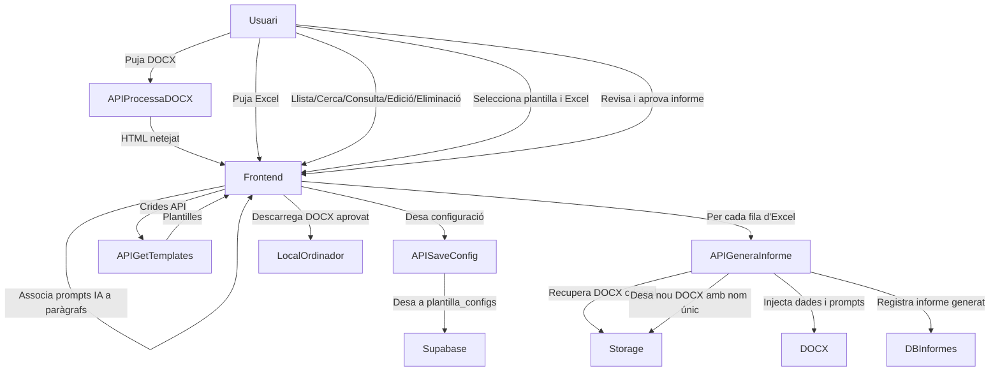

ok# Arquitectura de la Plataforma Intel·ligent de Gestió i Generació d’Informes

## 1. Visió General

Aquesta plataforma permet:
- Crear i modificar plantilles DOCX amb vinculacions dinàmiques a dades d’Excel.
- Vincular capçaleres d’Excel a fragments del document.
- Associar paràgrafs a prompts d’IA.
- Desar tota la configuració estructurada a Supabase.
- **Gestionar completament les plantilles desades: llistar, cercar, consultar, editar i eliminar.**
- Generar automàticament múltiples informes DOCX personalitzats (un per cada fila d’Excel), a partir de la plantilla original, injectant-hi les dades i instruccions corresponents.
- Permetre a l’usuari descarregar i desar localment els informes DOCX aprovats al seu ordinador.

## 2. Estat Actual del Projecte

**Implementat:**
- Backend modular amb Next.js API Routes per a:
  - Processament de documents (DOCX, Excel, PDF).
  - Gestió de plantilles (llista, consulta, edició, eliminació).
  - Pujada i gestió d’arxius.
  - Funcionalitats avançades de xat i integració amb IA.
- Frontend Next.js ric i interactiu per a la creació, edició i gestió de plantilles:
  - Llistat de plantilles.
  - Cerca i filtratge.
  - Consulta de detall.
  - Edició de plantilles.
  - Eliminació de plantilles.
- **Autenticació d’usuaris implementada amb Supabase Auth i polítiques RLS configurades.**
- Integració amb Supabase per a emmagatzematge i autenticació.
- Integració amb Tailwind CSS per a l’estilització.
- Documentació tècnica i d’arquitectura.
- Càrrega i conversió de DOCX a HTML (mammoth + cheerio).
- Pujada i processament d’Excel, extracció de capçaleres.
- Vinculació d’Excel a parts del document (spans amb data-excel-header).
- Associació de paràgrafs a instruccions d’IA (data-paragraph-id).
- Desat de la configuració a la taula `plantilla_configs` de Supabase.

**Millores recents (abril 2025):**
- Substitució directa del paràgraf pel prompt d'instrucció IA al document.
- Botons d'editar i eliminar instrucció IA en horitzontal, alineats i sense desplaçar el text.
- Restauració automàtica del text original en eliminar la instrucció IA.
- Opció a la UI per decidir si el prompt d'IA inclou el text original del paràgraf o el substitueix completament.

**Pendent:**
- Millores i refinament de l’autenticació i permisos (ajustar RLS, UX d’inici de sessió, etc.).
- Models de dades per a informes generats i documents associats a files d’Excel.
- Pujada del DOCX original a Supabase Storage i referència a la base de dades.
- Integració d’IA (OpenAI) per processar i refinar informes.
- Generació d’informes DOCX a partir de la plantilla Word original, injectant dades i resultats per a cada fila d’Excel, i desant cada informe amb un nom únic.
- Descarrega local dels informes DOCX aprovats per part de l’usuari.
- Càrrega i processament de PDFs, base de coneixement i consulta creuada.
- **Tests automatitzats (unitaris i d’integració).**
- **Pipeline de CI/CD.**
- **Validació d’errors i control d’accés complet a tots els endpoints.**
- **Internacionalització de la interfície.**
- **Documentació d’ús per a usuaris finals.**

## 3. Flux de Treball



## 4. Arquitectura Modular

```mermaid
graph TD
    subgraph Frontend (Next.js + React)
        UI[Editor DOCX/Excel/IA]
        PlantillesUI[Gestió de Plantilles (llista, cerca, consulta, edició, eliminació)]
        GeneracioUI[Generació d'Informes]
        DescarregaUI[Descarrega d'Informes]
    end

    subgraph Backend (API Routes)
        APIProcessaDOCX[Processament DOCX]
        APISaveConfig[Desar Configuració]
        APIGetTemplates[Recuperar Plantilles]
        APIGetTemplate[Recuperar Plantilla per ID]
        APIDeleteTemplate[Eliminar Plantilla]
        APIGeneraInforme[Generació d'Informes DOCX]
    end

    subgraph Supabase
        DBPlantilles[Taula: plantilla_configs]
        DBInformes[Taula: informes generats]
        Storage[Storage: DOCX originals i informes]
    end

    UI --> APIProcessaDOCX
    PlantillesUI --> APIGetTemplates
    PlantillesUI --> APIGetTemplate
    PlantillesUI --> APIDeleteTemplate
    UI --> APISaveConfig
    GeneracioUI --> APIGeneraInforme
    DescarregaUI --> APIGeneraInforme

    APIProcessaDOCX --> UI
    APISaveConfig --> DBPlantilles
    APIGetTemplates --> DBPlantilles
    APIGetTemplate --> DBPlantilles
    APIDeleteTemplate --> DBPlantilles
    APIGeneraInforme --> Storage
    APIGeneraInforme --> DBInformes
    APIGeneraInforme --> DescarregaUI
```

## 5. Roadmap Recomanat

1. **Refinar i millorar l’autenticació i permisos**
   - Revisar i ajustar Supabase Auth i RLS segons necessitats reals d’ús i seguretat.
2. **Models de dades**
   - Crear taules per a informes generats i documents associats.
3. **Pujada i gestió del DOCX original**
   - Pujar el DOCX a Storage i desar la ruta a la base de dades.
4. **Integració d’IA**
   - API Route per processar instruccions de la IA.
5. **Generació d’informes DOCX a partir de la plantilla Word**
   - Per cada fila d’Excel, recuperar el DOCX original, injectar dades i instruccions, desar el nou DOCX amb nom únic i registrar-lo.
6. **Descarrega local d’informes aprovats**
   - Permetre a l’usuari revisar, aprovar i descarregar localment els informes DOCX.
7. **Base de coneixement i consulta creuada**
   - Implementar càrrega i processament de PDFs, indexació i cerca.
8. **Tests automatitzats i CI/CD**
   - Afegir tests unitaris i d’integració, i configurar pipelines d’integració contínua.
9. **Validació i control d’errors**
   - Revisar i reforçar la validació d’inputs i la gestió d’errors a tot el backend.
10. **Internacionalització**
    - Preparar la UI per a múltiples idiomes.
11. **Documentació d’usuari**
    - Crear guies d’ús i documentació per a usuaris finals.

---

## 6. Què hem de fer ara (Pròxims passos immediats)

1. **Refinar i validar l’autenticació d’usuaris i permisos (Supabase Auth + RLS).**
2. **Definir i crear els models de dades per a informes generats i documents associats.**
3. **Implementar la pujada i gestió del DOCX original a Supabase Storage.**
4. **Desenvolupar la integració d’IA per processar i refinar informes.**
5. **Afegir tests automatitzats i configurar un pipeline de CI/CD.**
6. **Revisar la validació d’errors i el control d’accés a tots els endpoints.**
7. **Planificar la internacionalització de la interfície.**
8. **Completar la documentació d’ús per a usuaris finals.**

---

Aquest arxiu serveix com a referència central per a l’arquitectura, fluxos i roadmap del projecte, i s’ha d’actualitzar a mesura que evolucioni la implementació.