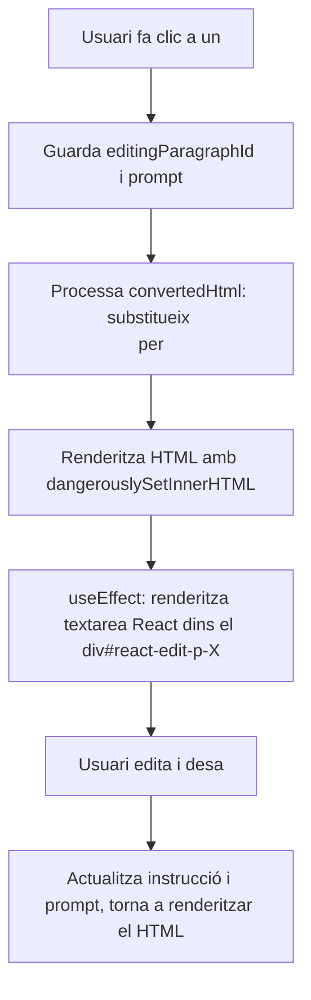

# Pla per a Edició Ràpida de Paràgrafs amb Textarea Inline a "textami"

## Objectiu

Permetre que, al fer clic sobre un paràgraf del document, aquest es substitueixi per un textarea editable dins el flux del document, facilitant una edició ràpida i visual de les instruccions IA associades.

---

## Estat

- `editingParagraphId`: id del paràgraf en edició.
- `editingPrompt`: valor actual del textarea.

---

## Flux d'Interacció

---

## Passos Tècnics

1. **Gestió d'Estat**
   - Afegir a l'estat: `editingParagraphId` i `editingPrompt`.

2. **Clic sobre Paràgraf**
   - Quan l'usuari fa clic sobre un `
`, es guarda el seu `data-paragraph-id` i el prompt associat (o el text original si no n'hi ha).

3. **Processament del HTML**
   - Es processa `convertedHtml` per substituir el `
...
` per un placeholder especial: `

`.

4. **Renderitzat**
   - Es mostra el HTML processat amb `dangerouslySetInnerHTML`.
   - Amb un `useEffect`, es renderitza un textarea React dins del div#react-edit-p-X (React Portal o render condicional).

5. **Edició i Desament**
   - L'usuari pot editar el prompt directament.
   - En desar, s'actualitza la instrucció i es torna a renderitzar el HTML, mostrant el prompt dins el `
`.

6. **Sortida del Mode Edició**
   - Si es fa clic fora o es desa, es surt del mode edició i es mostra el paràgraf amb el prompt aplicat.

---

## Avantatges

- Edició directa i ràpida dins el flux del document.
- UX molt visual i intuïtiva.
- No es perd la relació entre paràgraf i instrucció.
- Escalable i millorable amb validacions o funcionalitats addicionals.

---

## Consideracions

- Només un paràgraf pot estar en mode edició a la vegada.
- Cal garantir la persistència dels `data-paragraph-id` per mantenir la relació entre paràgraf i instrucció.
- El sistema pot adaptar-se fàcilment a futures millores (validacions, controls addicionals, etc).