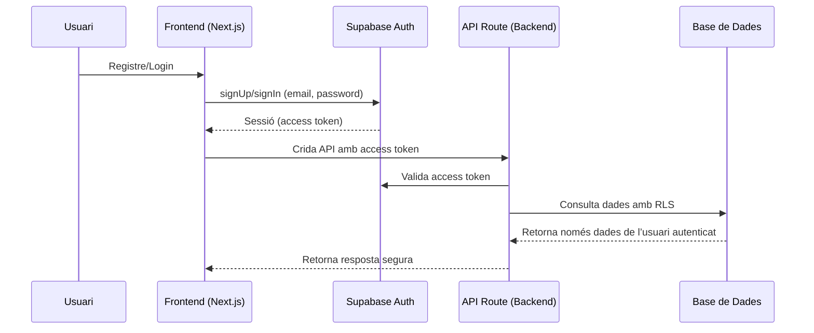

# Pla per a la Implementació de l’Autenticació d’Usuaris i Permisos amb Supabase Auth i RLS

## 1. Creació del client Supabase per al frontend

- Crear `lib/supabase/client.ts` amb la public key (`NEXT_PUBLIC_SUPABASE_ANON_KEY`).
- Aquest client servirà per a la gestió de sessions d’usuari al frontend (registre, login, logout).

## 2. Implementació de la UI d’autenticació

- Crear pàgines o components per:
  - Registre d’usuari (sign up)
  - Login (sign in)
  - Logout
  - Recuperació de contrasenya (opcional)
- Mostrar l’estat de sessió a la UI (usuari connectat/desconnectat).

## 3. Configuració de RLS (Row Level Security) a Supabase

- Activar RLS a les taules sensibles (`plantilla_configs`, `informes generats`, etc.).
- Definir policies perquè cada usuari només pugui accedir a les seves dades.
- Exemple de policy:
  ```sql
  CREATE POLICY "Users can access their own templates"
    ON plantilla_configs
    FOR SELECT USING (user_id = auth.uid());
  ```

## 4. Adaptació de les API routes

- Modificar les API routes perquè validin la sessió de l’usuari.
- Passar el JWT del frontend al backend per validar l’usuari a Supabase.
- Exemple: a cada request, incloure l’access token a l’header d’autorització.

## 5. Flux d’usuari i permisos (Mermaid)



## 6. Tasques concretes

1. Crear `lib/supabase/client.ts` amb la configuració adequada.
2. Implementar la UI d’autenticació.
3. Configurar RLS i policies a Supabase.
4. Adaptar les API routes per validar l’usuari.
5. Testar el flux complet d’autenticació i permisos.

---

Aquest pla cobreix la integració completa d’autenticació i permisos amb Supabase Auth i RLS, i pot servir de guia per a la seva implementació.