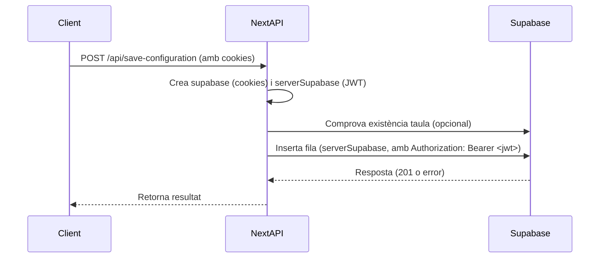

# Debug Supabase RLS: Inserció amb auth.uid() i JWT

## Problema

Quan la taula `plantilla_configs` de Supabase té una política RLS com:
```sql
(user_id = auth.uid())
```
la inserció d’una fila requereix que la request porti el token JWT de l’usuari autenticat a l’header `Authorization`. Si no, PostgREST no pot resoldre `auth.uid()` i rebutja la fila amb l’error:

```
code: '42501'
message: 'new row violates row-level security policy for table "plantilla_configs"'
```

## Diagnòstic

- El client creat amb `createRouteHandlerClient({ cookies })` només llegeix la sessió per a `.auth.*`, però **no** injecta automàticament el header `Authorization` a les crides `.from(...).insert(...)`.
- Perquè la política RLS funcioni, cal fer la inserció amb un client Supabase manual que porti el JWT a l’header.

## Solució

1. Obtenir el token JWT de la sessió.
2. Crear un client Supabase manual amb el JWT a l’header.
3. Fer la inserció amb aquest client.

### Exemple de codi

```ts
// 1. Obtenir la sessió i el token
const { data: { session }, error: sessionError } = await supabase.auth.getSession();
if (sessionError || !session) {
  return NextResponse.json({ error: 'No s\'ha pogut recuperar la sessió' }, { status: 401 });
}
const accessToken = session.access_token;

// 2. Crear el client manual amb JWT
import { createClient as createAnonClient } from '@supabase/supabase-js';
const serverSupabase = createAnonClient(
  process.env.NEXT_PUBLIC_SUPABASE_URL!,
  process.env.NEXT_PUBLIC_SUPABASE_ANON_KEY!,
  {
    global: {
      headers: { Authorization: `Bearer ${accessToken}` }
    },
    auth: { persistSession: false }
  }
);

// 3. Inserir la fila amb el client autenticat
const { data: insertedData, error: dbError } = await serverSupabase
  .from('plantilla_configs')
  .insert([configToInsert])
  .select()
  .single();

if (dbError) {
  // Gestió d’errors...
}
```

## Flux visual



## Resum

- **Sempre** fes la inserció a taules protegides per RLS amb un client que porti el JWT a l’header Authorization.
- Això garanteix que `auth.uid()` retorna el user_id correcte i la política RLS s’acompleix.
- Si no, obtindràs l’error 42501.